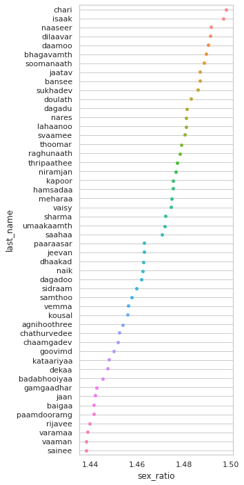

## The First Name in Sexism: Adult Sex Ratio By Last Name

Using data on over 35M people from the [Indian Electoral Rolls](https://github.com/in-rolls/electoral_rolls) (parsed data [here](https://dataverse.harvard.edu/dataset.xhtml?persistentId=doi:10.7910/DVN/MUEGDT)), we estimate sex ratio by the last name. (We plan to augment the analysis with [SECC](https://github.com/in-rolls/secc) data soon.)

Well over 90 million women are 'missing' in just seven Asian countries (see  [here](https://kar.kent.ac.uk/11409/1/WW-missingwomen-05.pdf) and [here](https://web.archive.org/web/20130504072819/http://ucatlas.ucsc.edu/gender/Sen100M.html) among other places). India alone accounts for over 12M missing women under 19 (see [here](https://en.wikipedia.org/wiki/Missing_women#Estimates)). Worse, "the vast majority of missing women in India ... are of adult age." (see [here](https://www.econ.nyu.edu/user/debraj/Papers/AndersonRay.pdf) and [here](https://papers.ssrn.com/sol3/papers.cfm?abstract_id=3190369)). The situation in India is not alarming everywhere. The sex ratio is above 1.10 in Daman and Diu, Dadra and Nagar Haveli, Chandigarh, Delhi, Haryana, Punjab, Andaman and Nicobar Islands, Sikkim, and Uttar Pradesh and .92 in Kerala and .96 in Puducherry (based on 2011 census; see [here](https://en.wikipedia.org/wiki/List_of_states_and_union_territories_of_India_by_sex_ratio)). But coarse geographies like states---in India, a state can have 200M people---can hide a bunch. To address this gap, we exploit the electoral roll data to describe variation in sex ratios by last names.

### Data and Methods

We use [parsed electoral rolls](https://dataverse.harvard.edu/dataset.xhtml?persistentId=doi:10.7910/DVN/MUEGDT) from 12 states and union territories:  Andaman and Nicobar Islands, Andhra Pradesh, Dadra and Nagar Haveli, Daman and Diu, Goa, Jammu and Kashmir, Manipur, Meghalaya, Mizoram, Nagaland, Puducherry. In all, we have data on about 35.6M adults. We start by filtering out unreliable data.

### Last Names

Indian names are famously complicated. To infer last names, we create rules that lead to us making fewer false positives than negatives.

We start by removing unreliable data and cases where we cannot infer the last name. We split the full name into words and remove one-word names and cases where the last word has fewer than two characters. We lose about 591k records as a result of that. Next, we remove names with non-alphabetical characters. We lose ~ 116k records as a result of that. We also remove cases where the birth date is before 1900. We lose 260 records as a result of that.

While there were at least 490k who identified as 'third gender' in India (based on the 2011 census, see [here](https://en.wikipedia.org/wiki/Hijra_(South_Asia)#cite_note-1)), or about .05% of the population, there were only eight people recorded as 'third gender' in the electoral rolls. The pro-rated expected number was ~ 17k. This suggests widespread underreporting. Given that only eight people were recorded as 'third gender,' precluding any analysis, we remove them from the data. This serves as the base data set we use for the analysis.

To infer last names, we look for last words in the name that are shared by more than one person in the household. (To enable that, we remove records with a missing household number of households with more than 20 people.) We then check how many of these names are shared by at least 1000 households. Of these names, we calculate sex-ratio and filter out names where the sex ratio is over 1.5 or under .5 assuming that these ratios map to first names than last names or reflect castes where on marriage people change last names, e.g., among Brahmins and Kshatriyas, women changed their name to devi after marriage (Here's a [list of names](data/last_name_failed_sex_ratio.txt) that we remove and [here's the final list of last names](data/best_guess_last_name.txt).)

### Script

* [Notebook](notebooks/last_sex_best_guess_last_name.ipynb)

### Results

We start by estimating aggregate sex ratios by last names that appear more than 10,000 times (output [here](tabs/sex_ratio_by_last_name_birth_year.csv)). We plot the last names with the most skewed (in favor of men) sex ratio:

**Note:** Ignore names by Mohammed and Syed as they are more often given to men. We plan to produce another version of this graph after manually inspecting the list of last names and winnowing it to a set with as few false positives as possible.

Next we subset on last names with at least 500 records in at least 25 years. (output [here](tabs/sex_ratio_by_last_name.csv)) We show the plot in this dynamic plotly graph [here](https://rawcdn.githack.com/soodoku/last_sex/b10b395e8db2edf94e0c7083cadce2dcc4ab5cb7/figs/plot-hover.html).

### Authors

Suriyan Laohaprapanon and Gaurav Sood
